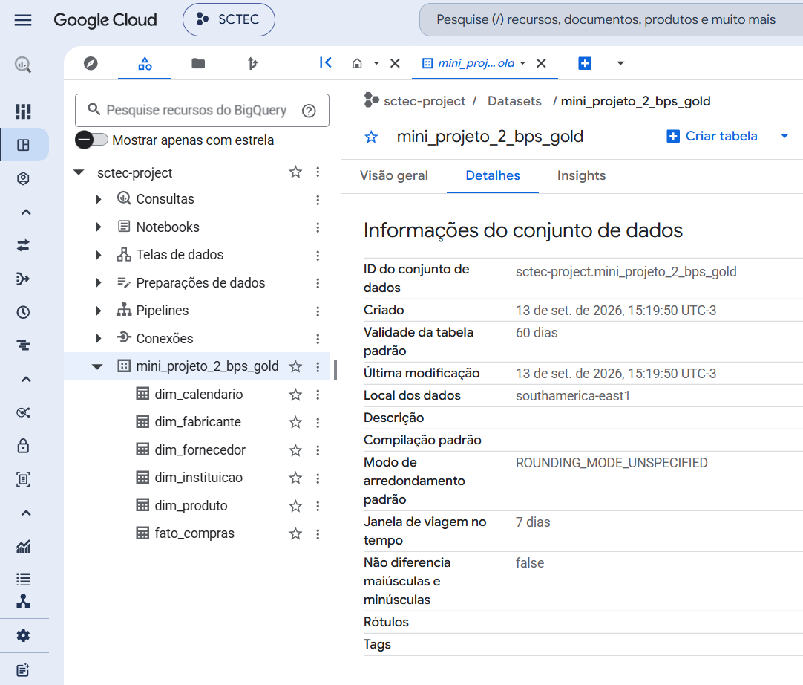
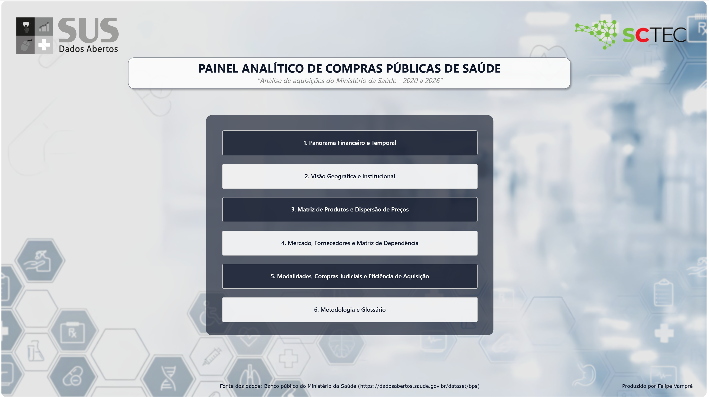
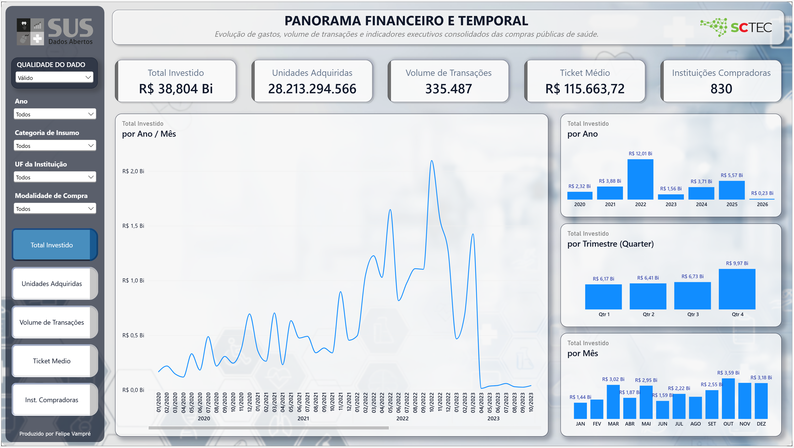
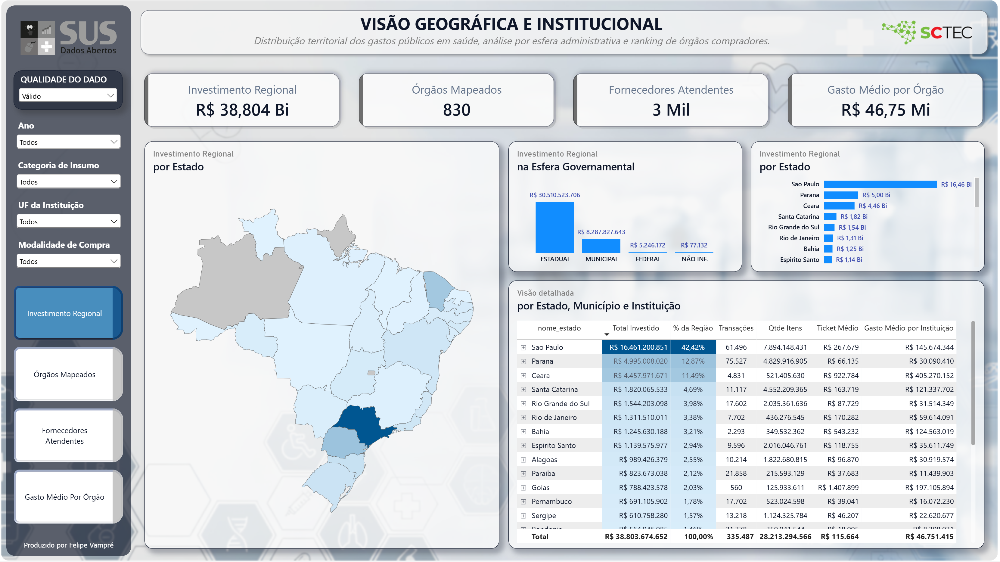
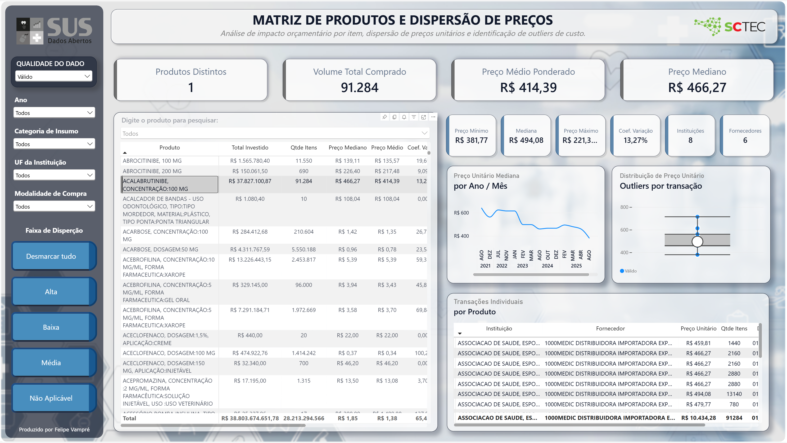
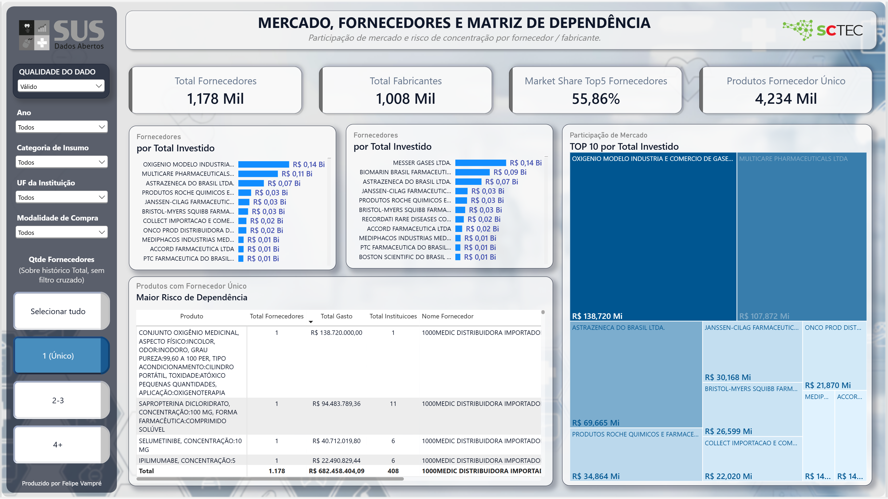
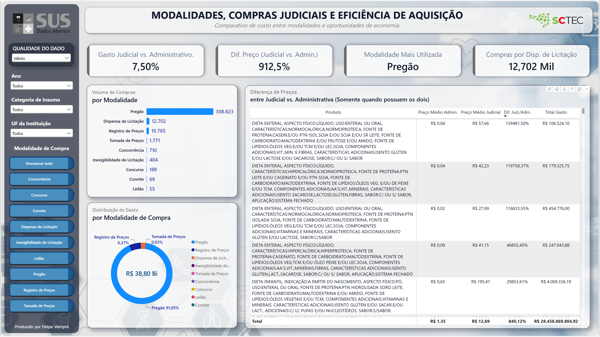

<br>
<br>

## 💻 Curso Datascience - Visualização de Dados e Business Intelligence. 

Mini Projeto Avaliativo - Módulo 2 - Semana 7

Aluno: Luiz Felipe F V Vieira

<br>
<br>

## 🔍 ETL / AED / BI: "Dashboard Analítico de Compras Públicas em Saúde (BPS - 2020 a 2026)" 
Utilizando o banco de dados público do Ministério da Saúde que reúne informações de compras públicas e privadas de medicamentos e dispositivos médicos.
(https://dadosabertos.saude.gov.br/dataset/bps)


<br>

### Link do Dashboard no Power BI

https://app.powerbi.com/groups/me/reports/bff2558e-1b4c-46e5-81b6-e7e542edbe34?ctid=172e7f38-d8a3-4f5c-8b80-c611fe2a1be3&pbi_source=linkShare

<br>

---

### 🎯 Propósito

> O desafio consiste em desenvolver um dashboard analítico para acompanhar as compras de medicamentos e dispositivos médicos registradas no Banco de Preços em Saúde (BPS) entre os anos de 2020 e 2026. O **objetivo** é praticar o pipeline de dados completo desde a aquisição dos dados até a disposição em um dashboard de BI. 

> Para tal proposta os dados foram baixados do site do Ministério da Saúde em arquivos distintos de cada ano (2020 a 2026), preparados e concatenados em um único conjunto de dados histórico e realizadas as etapas de ETL, AED e visualização no Microsoft Power BI. 

<br>

---

## 🛠️ Tecnologias Utilizadas

* **Formatos de Dados:** CSV / Parquet
* **Arquitetura de dados:** Medalhão (Bronze, Prata e Ouro)
* **Modelagem de dados:** Flat Table e Star Schema
* **Armazenagem:** Google BigQuery (Data Warehouse)
* **Ambiente:** VS Code / WSL / venv
* **Linguagem:** Python (Pandas), SQL
* **Pipeline:** Jupyter Notebook (execução sequencial)
* **Ferramenta de BI:** Microsoft Power BI

<br>

---

### 📦 Entregáveis

> O Projeto deverá ser entregue com os seguintes resultados:

<br>

1. - [x] Uma base consolidada com os arquivos do BPS referentes aos anos de 2020 a 2026

2. - [x] Um dashboard desenvolvido Microsoft Power BI.

3. - [x] Um arquivo `README.md` com a documentação do projeto.

4. - [x] Um vídeo de apresentação com duração máxima de 5 minutos.

5. - [x] A publicação do projeto completo no GitHub (Versionamento com branch e commit).

6. - [x] Arquivo `.ipynb` em Python (Jupyter Notebook) estruturado com as transformações e análises.

<br>

---

### ⚙️ Requisitos Funcionais (RF)

> O projeto deverá contemplar os seguintes sprints / etapas:

<br>

- [x] RF01: Sprint 1: Entendimento do problema e dos dados

- [x] RF02: Sprint 2: Preparação e concatenação das bases

- [x] RF03: Sprint 3: Definição das métricas e dos KPIs

- [x] RF04: Sprint 4: Construção do dashboard

- [x] RF05: Sprint 5: Análise dos resultados

- [x] RF06: Sprint 6: Organização e publicação


<br>

---

## 1. Objetivo do projeto

> Construir um pipeline de dados completo (ETL, Análise Exploratória e Modelagem em Arquitetura Medalhão - Bronze, Prata e Ouro) e um dashboard analítico interativo para monitorar, analisar e dar transparência às compras públicas de medicamentos e dispositivos médicos registradas no Banco de Preços em Saúde (BPS) entre 2020 e 2026.

<br>

O projeto visa transformar os dados brutos do BPS em uma solução de Business Intelligence baseada em KPIs, gráficos e filtros interativos para responder às seguintes questões de negócio:

* **Evolução Temporal:** Acompanhamento dos valores totais registrados ao longo dos anos.
* **Distribuição Geográfica e Institucional:** Identificação dos estados, municípios e órgãos com maior volume financeiro.
* **Curva de Produtos:** Mapeamento dos medicamentos e dispositivos médicos mais adquiridos.
* **Mercado fornecedor:** Análise de participação de fornecedores e fabricantes nas aquisições.
* **Variação de Preços:** Monitoramento de preços unitários entre produtos, instituições, regiões e períodos.
* **Modalidades de Compra:** Avaliação dos formatos de aquisição mais utilizados.
* **Oportunidades de Investigação:** Identificação de discrepâncias relevantes de preços para auditoria e gestão.

*Nota de contexto:* A identificação de variações de preços busca apontar oportunidades de investigação e não comprova, isoladamente, sobrepreço ou irregularidade. As divergências podem decorrer de fatores como especificações do fabricante, unidade de fornecimento, volume loteado, logística regional e momento da negociação.

<br>

---

## 2. Contextualização do problema

> A dispersão e o volume dos dados brutos de compras públicas de saúde dificultam o acompanhamento dos gastos, a comparação de preços praticados e a identificação de assimetrias de mercado entre diferentes entes federativos e períodos.

<br>

A gestão de suprimentos na saúde pública envolve expressivo volume financeiro e pulverização de fornecedores, exigindo mecanismos eficientes de controle e transparência. Os principais desafios enfrentados incluem:

* **Assimetria de Informação e Discrepância de Preços:** Diferentes órgãos públicos frequentemente adquirem os mesmos insumos por valores unitários significativamente distintos, sem visibilidade imediata das médias de mercado.
* **Volume e Fragmentação dos Dados:** A separação dos registros em bases anuais extensas impede uma análise histórica contínua e integrada sem o devido tratamento de dados.
* **Complexidade na Comparabilidade:** Variações nas descrições de produtos, unidades de fornecimento e modalidades de compra dificultam a tomada de decisão rápida durante os processos licitatórios.
* **Necessidade de Inteligência Fiscal e Operacional:** A ausência de painéis consolidados restringe a capacidade dos gestores e órgãos de controle em identificar gargalos e negociar melhores condições de aquisição.

Este projeto aborda a necessidade de consolidar um volume expressivo de dados históricos para transformar registros esparsos em inteligência operacional e fiscal.

<br>

---

## 3. Fonte dos dados

> Dados públicos de aquisições de medicamentos e dispositivos médicos obtidos a partir do Portal Brasileiro de Dados Abertos do Ministério da Saúde, cobrindo o período de 2020 a 2026. 

<br>

Os dados utilizados neste projeto têm como origem o **Banco de Preços em Saúde (BPS)**, mantido pelo Ministério da Saúde para registrar e dar transparência às compras públicas do setor:

* **Origem:** Ministério da Saúde — Banco de Preços em Saúde (BPS)
* **Endereço eletrônico:** https://dadosabertos.saude.gov.br/dataset/bps
* **Período Coberto:** 2020 a 2026 (7 arquivos anuais).
* **Formato Original:** Arquivos em formato `.csv`.
* **Armazenamento Inicial:** Diretório local `dados/bronze/` mantendo as estruturas originais (*raw data*).

Após auditoria estrutural na primeira fase do ETL, foi confirmada a consistência de 25 colunas idênticas em toda série histórica, totalizando 342.716 registros brutos.

<br>

---

## 4. Procedimentos utilizados para baixar e concatenar as bases anuais

> Download dos 7 arquivos em formato `.csv` (2020 a 2026), após submetidos a uma auditoria estrutural e preparados para consolidaçõa em um único arquivo.

<br>

* **Obtenção e Armazenamento:** Os conjuntos de dados públicos foram baixados do Portal Brasileiro de Dados Abertos do Ministério da Saúde e salvos na camada Bronze (dados/bronze/) preservando o formato original (raw data).

* **Extração:** Utilizou-se um dicionário de dados em Python via `pandas` para estruturar a leitura sequencial dos 7 arquivos anuais, garantindo o parseamento correto do encoding (`utf-8`) e do separador de campos.

* **Auditoria de Integridade:** Realizou-se a validação comparativa de colunas, confirmando a consistência de 25 campos idênticos em toda a série histórica, totalizando **342.716 registros brutos** prontos para a unificação.

* **Consolidação em DataFrame Único:** Executou-se a unificação vertical das tabelas via `pd.concat(dfs.values(), ignore_index=True)`, redefinindo a indexação e criando a base consolidada inicial que serve de insumo para a Camada Prata.

<br>

---

## 5. Tratamentos e transformações realizados nos dados (Camada Prata)

> Processamento completo da base consolidada (342.697 registros após deduplicação), incluindo padronização textual, imputação determinística de nulos, validações de domínio e otimização de memória.

<br>

As seguintes ações foram aplicadas:

1. **Deduplicação e Tratamento de Nulos:**
   * **Deduplicação:** Remoção de 19 registros totalmente idênticos.
   * **Imputação Determinística por Mapeamento Histórico:**
     * `nome_instituicao`: Preenchimento de nulos utilizando o histórico de registros do mesmo `cnpj_instituicao`.
     * `anvisa` e `generico`: Preenchimento de nulos via mapeamento pelo código `codigo_br` (CATMAT).
   * **Padronização de Nulos Residuais:** Atribuição do rótulo `'NÃO INF.'` para colunas categóricas sem histórico e `0` para o código ANVISA ausente. A coluna `capacidade` foi mantida como `NaN` para preservar a integridade estatística.
   * **Padronização da Coluna `esfera`:** Foram encontrados 4 valores únicos: 'MUNICIPAL', 'ESTADUAL', 'FEDERAL' E '0'. Todos os 43 registros encontrados com o valor '0' foram substituídos por `'NÃO INF.'`. 

2. **Normalização de Datas:**
   * **Formatação Temporal:** Conversão dos campos `compra` e `insercao` para o padrão `datetime64` utilizando o formato explícito brasileiro (`%d/%m/%Y` - padrão dos dados originais).
   * **Correção de Inconsistências de Data:** Aplicação de ***fallback*** para preencher 2.128 `insercao` ausentes com a data de compra e ajuste de 12 registros com data de `insercao` registrada como anterior à `compra`.

3. **Padronização Textual:**
   * **Limpeza de textos:** Foram encontrados 854 registros na coluna `descricao_catmat` com textos mal formatados contendo código HTML. Todos os campos foram limpos utilizando 'Regex' para reconhecer e remover tags HTML e funções como `html.unescape()` para decodificar entidades, `.replace()` e `re.sub()` para substituir os caracteres mal formatados.
   * **Padronização de Strings:** Aplicação de caixa alta (`UPPER` - padrão original do banco) e remoção de espaços nas extremidades (`TRIM`) em colunas de texto, preservando a integridade dos nulos.

4. **Downcasting e Otimização de Memória RAM:**
   * **Inteiros:** Redução de precisão para tipos compactos (`ano_compra` para `int16` e `codigo_br` para `int32`).
   * **Categorização (`category`):** Conversão de 9 colunas string categóricas de baixa/média cardinalidade (`esfera`, `uf`, `generico`, `modalidade_compra`, `tipo_compra`, `unidade_medida`, `unidade_fornecimento`, `unidade_fornecimento_capacidade`, `municipio_instituicao`).
   * **Resultado de Performance:** Redução do uso de memória RAM de **171 MB para 124 MB** (uma otimização de **27.3%** no consumo).

<br>

---

## 6. Descrição das principais colunas utilizadas e carga no Google BigQuery

> Definição da arquitetura da Camada Ouro (Gold), detalhamento das transformações e engenharia de recursos (*feature engineering*), dicionário de dados do Star Schema e estratégia de disponibilização no Data Warehouse (Google BigQuery).

<br>

### 6.1. Engenharia de Features e Descarte de Colunas (Pruning)

Para otimizar o consumo de memória RAM, acelerar o processamento analítico e preparar os dados para o consumo nas ferramentas de BI (Power BI/Looker Studio), a Camada Ouro passou por quatro ações principais:

1. **Descarte de Colunas Inutilizadas (Pruning):**
   * `insercao`: Descartada por tratar-se de data de controle administrativo interno; as análises temporais negociais baseiam-se 100% na data efetiva de `compra`.
   * `capacidade`: Descartada devido ao alto volume de nulos (~63,6%) e redundância em relação às especificações textuais da `unidade_fornecimento` e `descricao_catmat`.
   * `unidade_medida`: Descartada por apresentar baixa completude e redundância em relação à `unidade_fornecimento`.
   * `ano_compra`: Descartada após auditoria estrutural confirmar 100% de equivalência com o ano extraído da coluna temporal nativa `compra`.

2. **Engenharia de Recursos (*Feature Engineering*):**
   * **Atributos Temporais Enxutos:** Extração dos campos inteiros `nr_ano` (`int16`), `nr_mes` (`int8`), `nr_trimestre` (`int8`) e `nr_dia_semana` (`int8`) a partir do campo `compra`.
   * **Categorização Negocial (`categoria_insumo`):** Criação de flag categórico classificando as aquisições em `'MEDICAMENTO'` (quando `generico != 'NÃO INF.'` ou `anvisa > 0`) e `'CORRELATO'` (para dispositivos, materiais e equipamentos médico-hospitalares).

3. **Sinalização de Qualidade do Dado (`flag_qualidade_dado`):**
   Auditoria estatística por transação, ao nível de `codigo_br + unidade_fornecimento_capacidade`, para identificar registros com forte indício de erro de digitação, unidade ou preço "sentinela" de sistema. Os critérios (calibrados por análise de crescimento marginal da distribuição real dos dados) são:
   * **Preço Acima do Padrão:** `preco_unitario` superior a 17,8x a mediana do grupo (p99 da razão transação/mediana).
   * **Preço Abaixo do Padrão:** `preco_unitario` inferior a 1/28,4 da mediana do grupo (p99 da razão inversa) **ou** `preco_unitario ≤ R$ 0,01` (limiar absoluto definido pelo ponto de menor crescimento marginal na cauda inferior da distribuição de preços).
   * **Quantidade Extrema:** `qtd_itens_comprados` superior a 24.700.000 unidades (percentil 99,9 da distribuição).
   
   Registros que violam mais de um critério recebem motivos concatenados. A flag preserva 100% das linhas (nenhum dado é excluído ou corrigido), permitindo análise segmentada por confiabilidade no dashboard.

4. **Cálculo de Dispersão de Preço (`coeficiente_variacao` e `faixa_dispersao_preco`):**
   Calculado por grupo de `codigo_br + unidade_fornecimento_capacidade`, utilizando exclusivamente transações classificadas como `Válido` na etapa anterior (evitando contaminação por outliers de qualidade). O Coeficiente de Variação (desvio padrão / preço médio) mede a variação legítima de mercado entre fornecedores, instituições e período. Os limiares de classificação foram definidos pelos quartis da distribuição (grupos com 2 ou mais transações): `Baixa` (CV ≤ 0,23), `Média` (CV entre 0,23 e 0,72) e `Alta` (CV > 0,72). Grupos com apenas 1 transação, ou cujas transações são majoritariamente suspeitas, recebem a classificação `Não Aplicável`, por ausência de base estatística confiável para o cálculo.


### 6.2. Arquitetura da Camada Ouro: Abordagens Implementadas

A Camada Ouro foi estruturada em duas abordagens complementares armazenadas no diretório `dados/ouro/`:

#### A. Abordagem 1: Tabela Única Denormalizada (`df_ouro`)

Como pré-requisito do projeto foi solicitado realizar a preparação e a concatenação das bases em um único conjunto de dados histórico chamado BPS_20_26_NomeDoAluno.csv. Portanto, foi criada uma tabela *Flat* consolidada com 21 colunas estratégicas e as 8 novas colunas calculadas, totalizando 29 colunas. É ideal para explorações rápidas, rotinas ad-hoc de Data Science e cargas em ferramentas que performam melhor com tabelas únicas de média cardinalidade.

#### B. Abordagem 2: Modelagem Dimensional (*Star Schema*)

Apesar do volume total de dados não serem expressivos (342.697 linhas), para simular um ambiente cloud profissional de alta escala, foi criada uma estrutura relacional otimizada (Star Schema) para Data Warehouse e BI, eliminando redundâncias textuais na tabela de fatos e garantindo integridade referencial por meio de chaves substitutas (*Surrogate Keys - SKs*).

Antes da criação das tabelas dim_instituicao, dim_fornecedor e dim_fabricante forma feitas auditorias de duplicidade e econtrado 9 Instituições (mesmo CNPJ) com variações de cadastro. Na criação da dim_instituicao foi utilizado o cadastro mais recente destas instituições.

```
fato_compras
│
├─── sk_calendario ──── N:1 ─── dim_calendario
│
├─── sk_produto ─────── N:1 ─── dim_produto
│
├─── sk_instituicao ─── N:1 ─── dim_instituicao
│
├─── sk_fabricante ─── N:1 ─── dim_fabricante
│
└─── sk_fornecedor ──── N:1 ─── dim_fornecedor
```

### 6.3. Dicionário de Dados do Star Schema

#### 1. Tabela Fato: `fato_compras` (342.697 registros)
Armazena as métricas quantitativas/financeiras, informações específicas de cada compra e as chaves estrangeiras (FKs).
* `sk_calendario` (FK): Chave de data no formato `YYYYMMDD` (`int32`).
* `sk_instituicao` (FK): Chave da instituição compradora (`int32`).
* `sk_produto` (FK): Chave do produto/insumo (`int32`).
* `sk_fornecedor` (FK): Chave do fornecedor (`int32`).
* `sk_fabricante` (FK): Chave do fabriacnte (`int32`).
* `modalidade_compra`: Modalidade da aquisição (ex: Pregão, Dispensa) (`category`).
* `tipo_compra`: Categoria da compra (ex: `ADMINISTRATIVA`, `JUDICIAL`) (`category`).
* `unidade_fornecimento`, `unidade_fornecimento_capacidade`: Especificações do item da compra.
* `generico`, `anvisa`: Registros regulatórios sobre o item da compra.
* `flag_qualidade_dado`: Classificação da transação quanto a indícios de erro de preço ou quantidade, com motivo(s) associado(s) (`Válido`, `Suspeito - Preço Acima do Padrão`, `Suspeito - Preço Abaixo do Padrão`, `Suspeito - Quantidade Extrema`, ou combinações) (`category`).
* `coeficiente_variacao`: Coeficiente de Variação do preço unitário do grupo produto/apresentação (`codigo_br` + `unidade_fornecimento_capacidade`), calculado sobre transações válidas (`float64`).
* `faixa_dispersao_preco`: Classificação da dispersão de preço do grupo produto/apresentação (`Baixa`, `Média`, `Alta` ou `Não Aplicável`) (`category`).
* `qtd_itens_comprados`: Quantidade de unidades adquiridas (`int64`).
* `preco_unitario`: Preço pago por unidade (`float64`).
* `preco_total`: Valor total da transação (`float64`).

#### 2. Dimensão: `dim_calendario` (2.256 registros)
Mapeia a série temporal completa contínua (2020 a 2026).
* `sk_calendario` (PK): Código numérico `YYYYMMDD` (`int32`).
* `dt_completa`: Data real da transação (`datetime64`).
* `nr_ano`, `nr_mes`, `nr_trimestre`, `nr_dia_semana`: Atributos numéricos de tempo.
* `nm_mes`: Nome do mês em português (`Janeiro`, `Fevereiro`...) (`category`).
* `nm_dia_semana`: Nome do dia em português (`Segunda-feira`...) (`category`).
* `ds_ano_mes`, `ds_periodo`: Textos formatados (`YYYYMM` e `MM/YYYY`).

#### 3. Dimensão: `dim_instituicao` (831 registros)
Cadastro de órgãos e entidades compradoras da saúde pública.
* `sk_instituicao` (PK): Identificador único (`int32`).
* `cnpj_instituicao`: CNPJ da instituição.
* `nome_instituicao`, `esfera`, `municipio_instituicao`, `uf`: Atributos geográficos e administrativos.

#### 4. Dimensão: `dim_produto` (12.994 registros)
Catálogo unificado de medicamentos e materiais de saúde (CATMAT).
* `sk_produto` (PK): Identificador único (`int32`).
* `codigo_br`: Código do item no CATMAT.
* `descricao_catmat`: Descrição do item.
* `categoria_insumo`: Classificação (`MEDICAMENTO` / `CORRELATO`).

#### 5. Dimensão: `dim_fornecedor` (3.502 registros)
Mapeamento de empresas fornecedoras.
* `sk_fornecedor` (PK): Identificador único (`int32`).
* `cnpj_fornecedor`: CNPJ do distribuidor/vendedor.
* `fornecedor`: Nome do distribuidor/vendedor.

#### 6. Dimensão: `dim_fabricante` (2.290 registros)
Mapeamento de empresas fabricantes.
* `sk_fabricante` (PK): Identificador único (`int32`).
* `cnpj_fabricante`: CNPJ da indústria fabricante.
* `fabricante`: Nome da indústria fabricante.


### 6.4. Persistência dos dados Multi-Formato e Ingestão Cloud no Google BigQuery

#### A. Desempenho do Formato Apache Parquet:
Os datasets da Camada Ouro (Tabela Única) foram salvos (persistidos) nos formatos `.csv`, `.csv.gz` e `.parquet`. A adoção do **Parquet** proporcionou uma **redução de ~88,3% no tamanho do armazenamento** em relação ao CSV tradicional:

* **CSV Tradicional:** ~135,2 MB
* **CSV Compactado (.gz):** ~19 MB
* **Apache Parquet:** **15,7 MB** (Preservação de schemas, tipos de dados e alta performance de leitura).

Na arquitetura *Star Schema* a redução foi ainda maior. Somando os arquivos da tabela fato + dimensões, ficaram com os seguintes tamanhos:

* **CSV Tradicional:** ~27,5 MB
* **CSV Compactado (.gz):** ~5,7 MB
* **Apache Parquet:** 6,17 MB 


#### B. Carga no Data Warehouse (Google BigQuery):
Para simular um ambiente analítico em nuvem de nível corporativo e habilitar conexões de alta velocidade com ferramentas de BI, o modelo **Star Schema** foi ingerido no **Google BigQuery**:
* **Dataset no GCP:** `sctec-project.mini_projeto_2_bps_gold`
* **Tabelas Carregadas:** `fato_compras`, `dim_calendario`, `dim_instituicao`, `dim_produto`, `dim_fornecedor`, `dim_fabricante`.
* **Modo de Carga:** Ingestão direta dos arquivos `.parquet` com detecção automática de schema.
* **Integração BI:** O modelo está pronto para consumo via conexão nativa (Import Mode ou DirectQuery) no **Power BI** e/ou **Looker Studio**.

<br>



<br>

---

## 7. Definição dos KPIs, métricas e Pilares Analíticos

> Para a definição dos indicadores e KPIs, foi adotada a abordagem ***Business-Driven Data Modeling*** (Modelagem de Dados Orientada a Negócios). Essa abordagem parte da premissa de que os indicadores devem ser derivados diretamente dos objetivos estratégicos e dos processos de negócio — e não de uma visão puramente técnica dos dados disponíveis.

<br>

### Para estruturar as Perguntas de Negócio e KPIs, os dados foram analisados sob 5 grandes pilares analíticos/estratégicos:

1. **Panorama Financeiro e Temporal (Visão Geral Executiva)**
   * **Objetivo:** Evolução dos valores ao longo do tempo, volume de registros e apoio ao planejamento estratégico de gastos.
   * **KPIs Principais:**
      * Valor Total Registrado (R$): $`\text{Soma}(\text{preco\_total})`$
      * Quantidade Total de Itens: $`\text{Soma}(\text{qtd\_itens\_comprados})`$
      * Volume de Transações: $`\text{Contagem}(\text{linhas de } \text{fato\_compras})`$
      * Ticket Médio (R$): $`\frac{\text{Soma}(\text{preco\_total})}{\text{Volume de Transações}}`$
      * Instituições Compradoras: $`\text{Contagem Distinta}(\text{sk\_instituicao})`$  

2. **Análise Geográfica e de Instituições (Compradores)**
   * **Objetivo:** Identificar os estados, municípios e instituições compradoras de maior relevância e volume financeiro. Top UFs e Municípios com maior volume financeiro de compras. Top 10 Instituições com maior gasto acumulado e respectivo volume de itens comprados.
   * **KPIs Principais:**
      * Investimento Regional (R$): $`\text{Soma}(\text{preco\_total})`$
      * Instituições Compradoras: $`\text{Contagem Distinta}(\text{sk\_instituicao})`$
      * Fornecedores Atendentes: $`\text{Contagem Distinta}(\text{sk\_fornecedor})`$
      * Gasto Médio por Órgão (R$): $`\frac{\text{Soma}(\text{preco\_total})}{\text{Contagem Distinta}(\text{sk\_instituicao})}`$     

3. **Produtos, Insumos e Oportunidades de Investigação de Preço**
   * **Objetivo:** Medicamentos e correlatos mais adquiridos, análise da mediana/dispersão de preços e identificação de oportunidades de investigação sobre diferenças relevantes de preços. Top produtos por valor total e por quantidade total.
   * **KPIs Principais:**
     * Produtos Distintos: $`\text{Contagem Distinta}(\text{codigo\_br})`$
     * Preço Unitário Médio Ponderado: $`\frac{\text{Soma}(\text{preco\_total})}{\text{Soma}(\text{qtd\_itens\_comprados})}`$ (Exibido com alerta/contexto de unidade de fornecimento).
     * Preço Unitário Mediano: $`\text{Mediana}(\text{preco\_unitario})`$ (Métrica robusta contra outliers para comparação justa).

4. **Fornecedores e Fabricantes (Mercado e Concorrência)**
   * **Objetivo:** Avaliar a participação de mercado, concentração de fornecedores/fabricantes e apoiar a negociação pública.
   * **KPIs Principais:**
      * Fornecedores Únicos: $`\text{Contagem Distinta}(\text{sk\_fornecedor})`$
      * Fabricantes Únicos: $`\text{Contagem Distinta}(\text{sk\_fabricante})`$
      * Market Share Top 5 Fornecedores: $`\frac{\text{Soma}(\text{preco\_total}) \text{ dos 5 maiores fornecedores}}{\text{Soma}(\text{preco\_total}) \text{ total}}`$
      * Produtos com Fornecedor Único: $`\text{Contagem Distinta}(\text{sk\_produto})`$ com $`\text{Contagem Distinta}(\text{sk\_fornecedor}) = 1`$  

5. **Eficiência de Compras, Modalidades e Recomendações**
   * **Objetivo:** Identificar as modalidades de compra mais utilizadas, comparar compras administrativas vs. judiciais e consolidar recomendações baseadas em dados com suas limitações. Verificar a distribuição do valor gasto por modalidade de compra e tipo ao longo dos anos.
   * **KPIs Principais:**
      * Gasto Judicial vs. Administrativo (%): $`\frac{\text{Soma}(\text{preco\_total}) \text{ onde } \text{tipo\_compra} = \text{JUDICIAL}}{\text{Soma}(\text{preco\_total}) \text{ total}}`$
      * Diferença de Preço (Judicial vs. Administrativo) (%): $`\frac{\text{Preço Médio Ponderado Judicial} - \text{Preço Médio Ponderado Administrativo}}{\text{Preço Médio Ponderado Administrativo}}`$
      * Modalidade Mais Utilizada: modalidade com maior $`\text{Soma}(\text{preco\_total})`$
      * Quantidade de Compras por Dispensa de Licitação: $`\text{Contagem}(\text{linhas onde } \text{modalidade\_compra} = \text{"Dispensa de Licitação"})`$


### Diretrizes de Agregação Matemática e Regras Negociais Definidas:

1. **Soma:** Exclusiva para `preco_total` e `qtd_itens_comprados`.

2. **Preço Unitário:** Jamais somar. Utilizar *Médias Ponderadas* ($`\sum \text{Preço Total} / \sum \text{Quantidade}`$) para visões agregadas ou *Mediana* para identificar desvios/outliers em produtos específicos.

3. **Contagem Distinta:** Para CNPJs (Instituição, Fornecedor, Fabricante), CATMAT (codigo_br), UFs e Municípios.

4. **Filtros Globais Interativos:** Todos os 5 painéis contarão com slicers para Ano, UF, Modalidade de Compra, Categoria (MEDICAMENTO / CORRELATO) e Busca por CATMAT/Produto.

<br>

---

## 8. Link e imagens do dashboard

> O repositório conta com o arquivo do Power Bi `dashboard_bps.pbix` e também pode ser acessado através do link público: https://app.powerbi.com/groups/me/reports/bff2558e-1b4c-46e5-81b6-e7e542edbe34?ctid=172e7f38-d8a3-4f5c-8b80-c611fe2a1be3&pbi_source=linkShare

<br>

### 8.1. Capa do Dashboard

<br>

<br>

### 8.2. Panorama Financeiro e Temporal

<br>

<br>

### 8.3. Visão Geográfica e Institucional

<br>

<br>

### 8.4. Matriz de Produtos e Dispersão de Preços

<br>

<br>

### 8.5. Mercado, Fornecedores e Matriz de Dependências

<br>

<br>

### 8.6. Modalidades, Compras Judiciais e Eficiência de Aquisição

<br>

<br>

### 8.7. Metodologia e Glossário

<br>

<br>

---

## 9. Principais análises e descobertas

> A construção do dashboard revelou não apenas insights de negócio, mas também a necessidade de um tratamento criterioso de qualidade e estrutura de dados antes da análise final.

<br>

**9.1. Tratamento e padronização da base bruta**
Antes da modelagem analítica, a base passou por um processo estruturado de limpeza: remoção de duplicidades, imputação determinística de nulos (por histórico de CNPJ e mapeamento por CATMAT), normalização de datas com correção de inconsistências temporais, e padronização textual, incluindo a remoção de código HTML mal formatado presente em 854 descrições de produtos. Esse tratamento garantiu a confiabilidade da base antes de qualquer análise estatística.

<br>

**9.2. Outliers de preço e quantidade como achado analítico**
A análise identificou transações com preços unitários extremos (tanto "sentinela", próximos de zero, quanto valores muito acima da mediana do próprio produto) e quantidades compradas logisticamente inviáveis. Optou-se por **não excluir ou corrigir** esses registros, preservando a integridade histórica da base, e sim sinalizá-los através da coluna `flag_qualidade_dado`, permitindo análise segmentada (dados válidos vs. suspeitos) diretamente no dashboard.

<br>

**9.3. Critérios de qualidade de dado calibrados estatisticamente**
Os limiares de sinalização (preço muito acima ou abaixo da mediana do grupo, preço-piso absoluto e quantidade extrema) não foram definidos de forma arbitrária, mas calibrados a partir da análise de crescimento marginal da distribuição real dos dados, identificando os pontos de ruptura estatística entre variação normal de mercado e valores atípicos.

<br>

**9.4. Dispersão de preço como indicador de oportunidade de negociação**
O Coeficiente de Variação, calculado por produto e apresentação (excluindo transações suspeitas), permitiu classificar uma parcela relevante dos produtos como de "Alta" dispersão de preço, sinalizando oportunidades de investigação e negociação para o setor de compras públicas.

<br>

**9.5. Concentração de mercado e risco de dependência**
A análise de fornecedores identificou produtos adquiridos por um único fornecedor ao longo de todo o histórico da base, representando risco de dependência/monopólio de fornecimento, informação estratégica para negociação e planejamento de contingência.

<br>

**9.6. Diferença de custo entre compras Administrativas e Judiciais**
A comparação de preço unitário para os mesmos produtos adquiridos nas duas modalidades evidenciou casos de sobrepreço em compras judiciais, reforçando a importância de monitoramento e planejamento de estoque para reduzir a dependência de aquisições emergenciais via decisão judicial.

<br>


---

## 10. Recomendações baseadas nos dados

> As descobertas da análise sugerem oportunidades concretas de atuação para gestores de compras públicas de saúde, com ressalvas sobre as limitações dos dados.

<br>

**10.1. Priorizar investigação dos produtos de Alta Dispersão de Preço**
Produtos classificados com Coeficiente de Variação "Alta" (Página 3) devem ser priorizados em auditorias de preço e processos de negociação, a variação legítima entre instituições/fornecedores pode indicar oportunidade de padronização de preço-teto ou renegociação de contratos.

<br>

**10.2. Revisar produtos com Fornecedor Único**
Produtos identificados com apenas 1 fornecedor ao longo de todo o histórico (Página 4) representam risco de continuidade de abastecimento. Recomenda-se mapear alternativas de fornecimento e avaliar a viabilidade de diversificação, especialmente para os itens de maior volume financeiro.

<br>

**10.3. Reduzir dependência de compras judiciais em itens recorrentes**
Produtos com sobrepreço identificado em compras judiciais frente às administrativas (Página 5) sugerem falhas de planejamento de estoque. Recomenda-se reforçar o planejamento preventivo de aquisição desses itens específicos, reduzindo a necessidade de compras emergenciais via decisão judicial.

<br>

**10.4. Investigar transações sinalizadas como suspeitas**
Os registros marcados pela `flag_qualidade_dado` (Página 3) não foram confirmados como erro, apenas sinalizados estatisticamente. Recomenda-se auditoria pontual desses casos junto às instituições envolvidas, podendo revelar tanto falhas de digitação quanto padrões reais de negociação a serem investigados.

<br>

**10.5. Acompanhar concentração de mercado entre fornecedores**
O Market Share dos principais fornecedores (Página 4) deve ser monitorado ao longo do tempo, alta concentração pode reduzir o poder de negociação do setor público e aumentar a exposição a variações de preço impostas pelo mercado.

<br>

**10.6. Limitações a considerar**
As recomendações acima devem ser lidas em conjunto com a Página 6 (Metodologia e Glossário), em especial, a classificação de fornecedor único é baseada no histórico total da base (não filtrada por período), e a comparação Judicial vs. Administrativa pode ser influenciada por diferenças na composição de produtos adquiridos em cada modalidade.

<br>


---

## 11. Limitações identificadas na base ou na análise

> As limitações abaixo devem ser consideradas ao interpretar os resultados do dashboard, garantindo leitura crítica e uso responsável das análises.

<br>

**11.1. Dados sinalizados não são necessariamente erros confirmados**
A `flag_qualidade_dado` é resultado de critérios estatísticos (desvio em relação à mediana do grupo, preço-piso e quantidade extrema), não de verificação manual individualizada. Transações sinalizadas como "Suspeito" podem incluir casos legítimos (ex: negociações atípicas, situações emergenciais) que não representam erro de fato.

<br>

**11.2. Comparação Judicial vs. Administrativa sujeita a viés de composição**
A diferença de preço médio entre os dois tipos de compra pode ser influenciada pela diferença na cesta de produtos adquirida em cada modalidade, não exclusivamente pelo tipo de aquisição. A tabela comparativa por produto individual (Página 5) mitiga parcialmente esse viés, mas o KPI executivo agregado deve ser interpretado com essa ressalva.

<br>

**11.3. Classificação de Fornecedor Único é histórica, não filtrada**
A identificação de produtos com apenas 1 fornecedor (Página 4) considera todo o período da base (2020–2026), independentemente dos filtros de ano, UF ou demais recortes aplicados na tela. Um produto marcado como "Fornecedor Único" pode ter tido múltiplos fornecedores em períodos específicos não refletidos nesse indicador.

<br>

**11.4. Coeficiente de Variação depende do volume de transações**
Produtos com poucas transações (especialmente 1 única compra) não possuem CV estatisticamente confiável, sendo classificados como "Não Aplicável". Isso significa que parte dos ~13 mil produtos do catálogo não possui indicador de dispersão de preço disponível.

<br>

**11.5. Granularidade da Dimensão Produto**
A `dim_produto` utiliza `codigo_br` (CATMAT) como grão, consolidando diferentes apresentações comerciais (embalagens, capacidades) do mesmo item. Análises de preço no nível de apresentação específica (`unidade_fornecimento_capacidade`) estão disponíveis apenas na tabela fato e no painel de detalhe da Página 3, não na visão agregada por produto.

<br>

**11.6. Ausência de correção de outliers**
Nenhum valor de preço ou quantidade identificado como estatisticamente atípico foi alterado, substituído ou removido da base. Isso preserva a integridade histórica dos dados, mas significa que métricas agregadas (como médias simples) podem ser sensíveis a esses valores extremos, por isso a preferência por métricas robustas (mediana, preço médio ponderado) ao longo do dashboard.

<br>

**11.7. Escopo temporal e cobertura**
A base cobre o período de 2020 a 2026, mas não há garantia de cobertura completa e uniforme de todas as instituições de saúde do país nesse intervalo, instituições podem ter aderido ao sistema de registro em momentos diferentes, afetando comparações históricas absolutas entre períodos.

<br>

---

## 12. Instruções para reprodução do projeto

> Guia passo a passo para configurar o ambiente de desenvolvimento, estruturar os diretórios e executar o pipeline de dados a partir dos arquivos brutos.

<br>

1. **Pré-requisitos:**
   * *Python:* Versão 3.12.3 ou superior instalado.
   * *Ambiente virtual .venv:* Criação do ambinte virtual e instalação das dependências.

<br>

2. **Clone o repositório e acesse a pasta:**

```bash
git clone https://github.com/lf-vampre/sctec-datascience-mini-projeto-2-1
cd sctec-datascience-mini-projeto-2-1
```

<br>

3. **Crie e ative o ambiente virtual (venv):**

```bash
python3 -m venv .venv # ou então: python -m venv .venv
```

* Ativação (Linux/WSL/MacOS):

```bash
source .venv/bin/activate
```

* Ativação (Windows - PowerShell):

```bash
.\.venv\Scripts\Activate.ps1
```

<br>

4. **Instale as dependências:**

```bash
pip install -r requirements.txt
```

<br>

5. **Execução do Pipeline:**

* Abra o arquivo `projeto_bps.ipynb` no vscode ou alguma IDE que reconheça `.ipynb`, selecione o kernel do python do ambiente .venv e rode todas as células ou uma a uma para acompanhar o pipeline de dados.

<br>

---

## 📜 Histórico de Commits (git log --oneline)

<br>


<br>